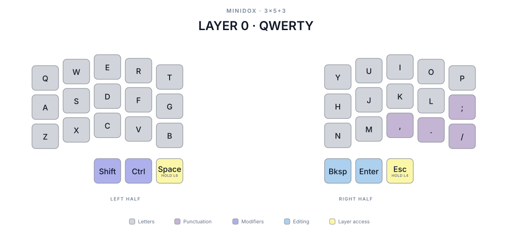
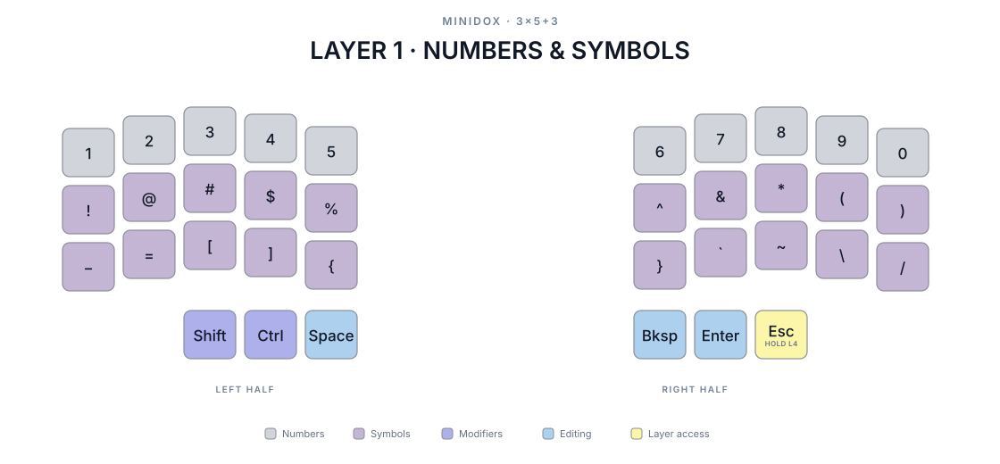
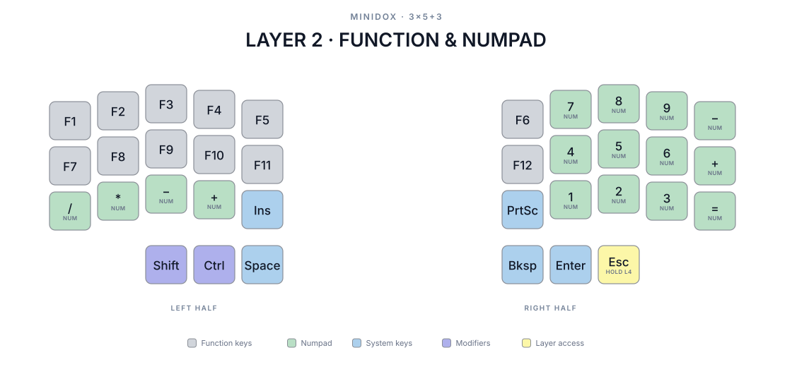
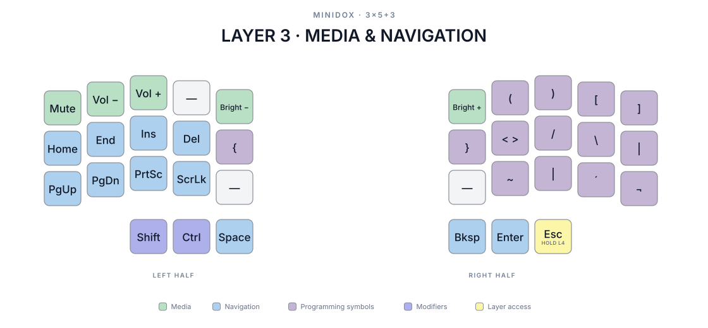
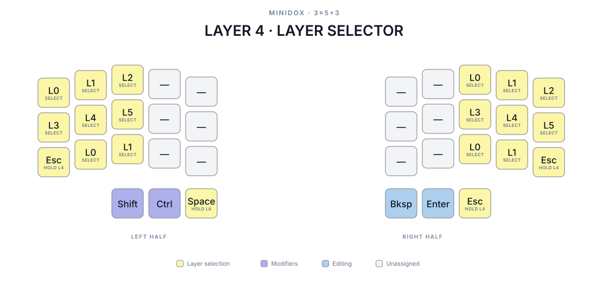
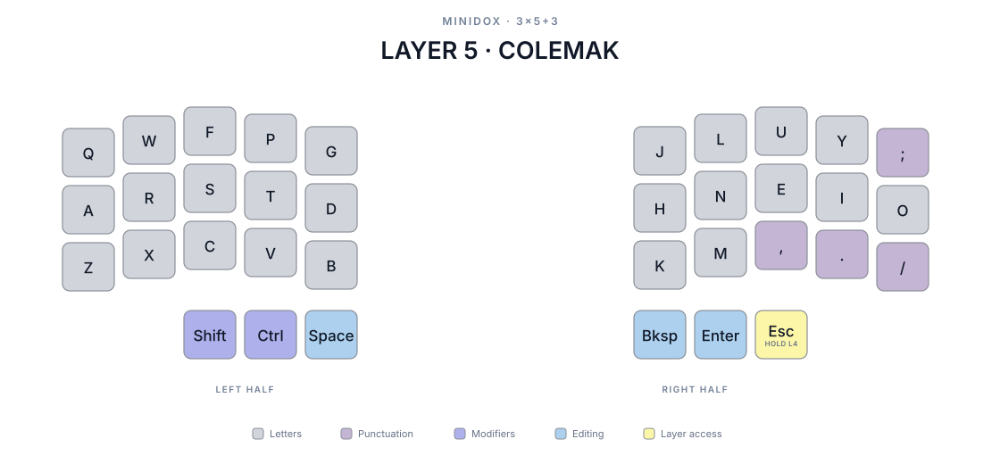
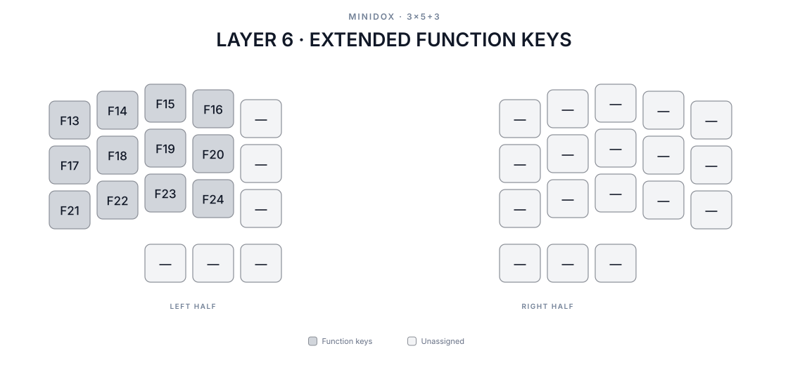

# Layer reference

These diagrams are generated from the current QMK keymap.

## Layer 0 — QWERTY



## Layer 1 — Numbers and symbols



## Layer 2 — Function and numpad



## Layer 3 — Media and navigation



## Layer 4 — Layer selector



## Layer 5 — Colemak



## Layer 6 — Extended function keys



The `F13`–`F24` block is available for host-defined shortcuts. The configured
desktop host maps these positions to virtual desktops 1–12.

## Regenerating

The diagrams are generated by
[`scripts/generate_layer_diagrams.py`](../../../scripts/generate_layer_diagrams.py)
directly from the QMK keymap JSON. The generator uses only the Python standard
library and requires Python 3.10 or newer.

From the repository root, run the Make target:

```sh
make diagrams
```

The target runs `scripts/generate_layer_diagrams.py` with Python 3.

The source keymap is:

```text
keyboards/maple_computing/minidox/rev1/keymaps/qwerty_colemak/keymap.json
```

The command deterministically rewrites the active layer diagrams in this
directory. Layer titles, legend labels, colors, and output filenames are
defined in `LAYER_METADATA` inside the generator.
